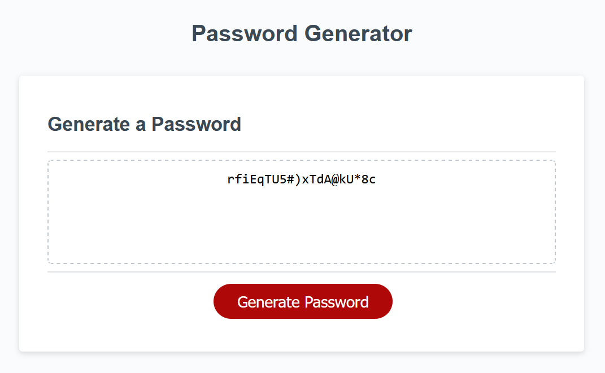

# Password Generator Starter Code

## Description

This a website the allows the user to generate a password between 8 and 128 character in length and containing the types of characters they wish to include.

## Installation

N/A

## Usage

Click on the Generate Password button to generate a new password. Enter a number between 8 and 128 for the desired password length, then click OK. For each of the character types, click OK if you want it included in your password and click Cancel if you want it excluded. After answering all the questions, a randomly generated password will be displayed abiding by the user's preferences.

## Link to deployed Application

## Screenshot
;

## Credits

The creation of this website was guided by the UW Coding Bootcamp.

## License

N/A